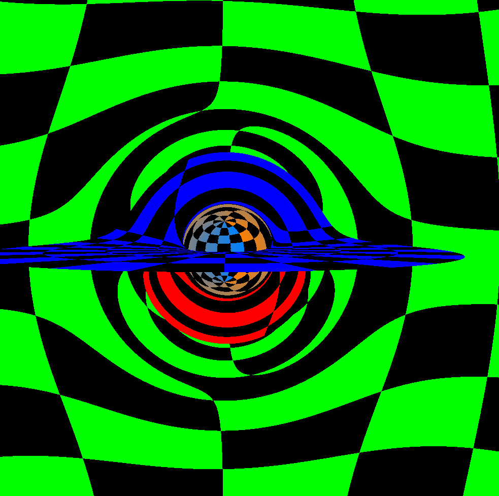

# ShadowEngine
[](https://github.com/pablogsal/ShadowEngine/actions/workflows/build.yml)

ShadowEngine is a CUDA-based ray tracing and visualization engine for simulating and rendering images of black holes. This project aims to provide a flexible and efficient framework for exploring the gravitational lensing and visual effects around black holes using ray tracing techniques.



## Features

- Real-time ray tracing simulations of black holes and their surroundings.
- Visualization of gravitational lensing, accretion disks, and other astrophysical phenomena.
- CUDA acceleration for high-performance simulations.

## Prerequisites

Before you begin, ensure you have met the following requirements:

- CMake 
- CUDA Toolkit
- OpenGL 
- GLUT 

## Building and Running

To build and run the ShadowEngine project, follow these steps:

1. Clone the repository:

   ```bash
   git clone https://github.com/your-username/ShadowEngine.git
   ```

2. Navigate to the project directory:

   ```bash
   cd ShadowEngine
   ```

3. Create a build directory:

   ```bash
   mkdir build
   cd build
   ```

4. Configure the project with CMake:

   ```bash
   cmake ..
   ```

5. Build the project:

   ```bash
   make
   ```

6. Run the executable:

   ```bash
   ./ShadowEngine
   ```

## Usage

- Use the following keys to control the camera:
  - 'a' and 'd': Move the camera closer to or farther from the black hole.
  - 'w' and 's': Adjust the camera's view angle (look up or down).
  - 'q' and 'e': Rotate the camera counterclockwise or clockwise.
  - 'ESC' key: Exit the application.

- Interact with the application to explore the black hole environment and visualize gravitational effects.

## License

This project is licensed under the MIT License - see the [LICENSE](LICENSE) file for details.